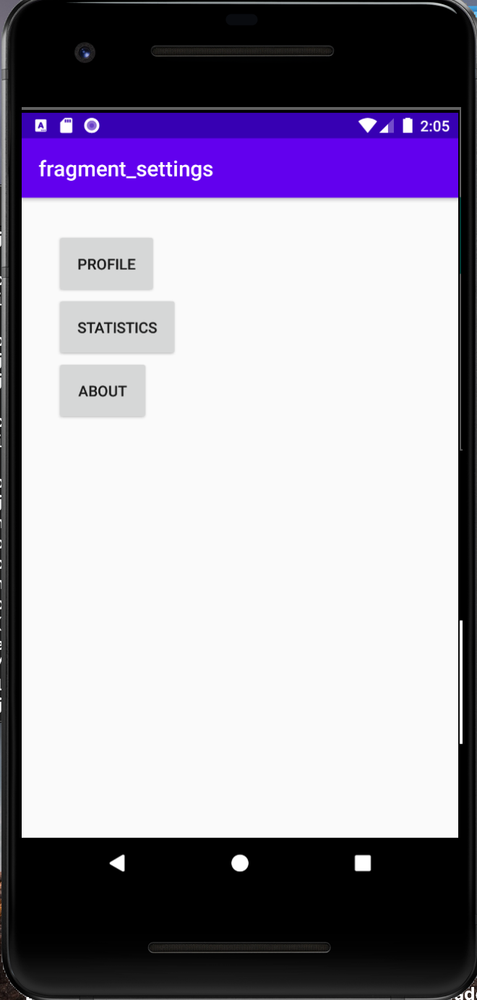
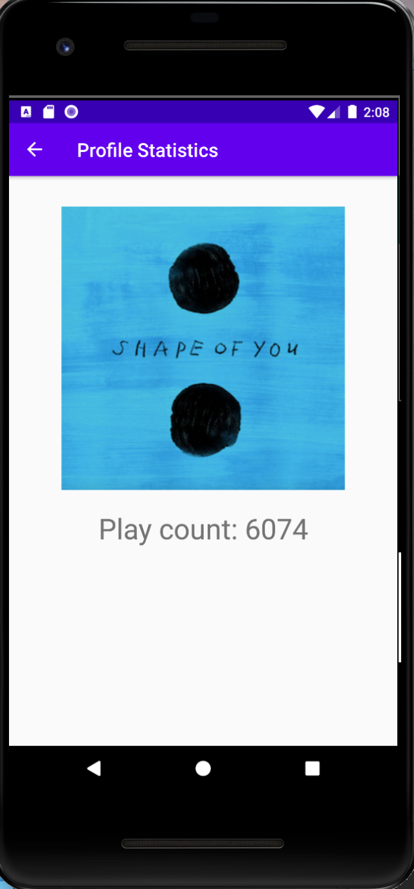
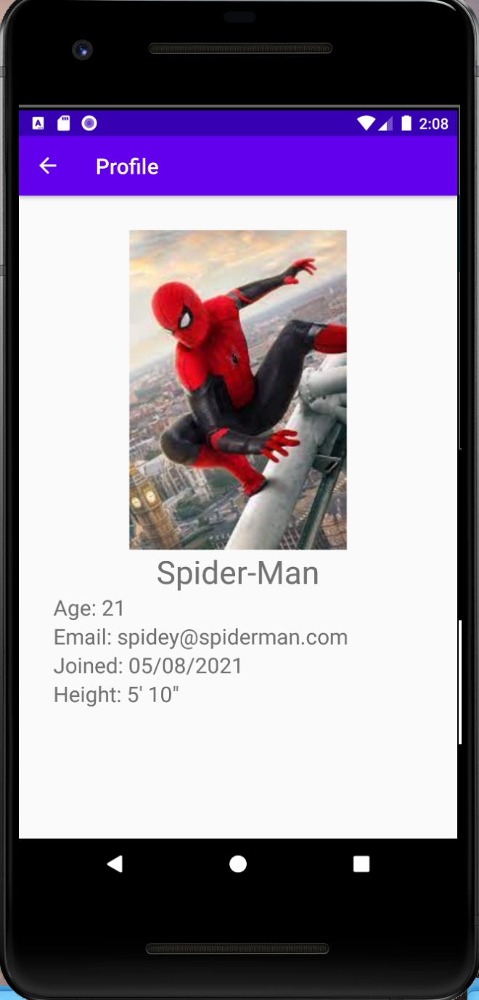
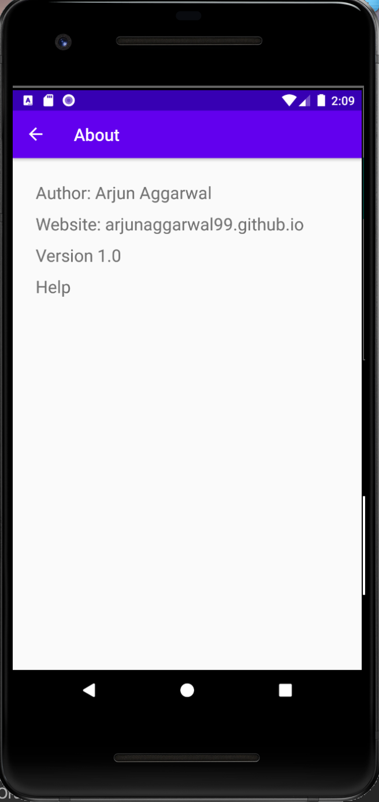

# Dotify by Arjun Aggarwal

This app provides a platform where people listen to music on the cloud!

## Documentation
[Song Data Provider API](https://github.com/echeeUW/SongDataProvider)

## Extra credit
I have completed extra credit #1.

## Screenshots
Song List with Mini Player |  Main Player
:-------------------------:|:-------------------------:
  |  

Settings |  Statistics
:-------------------------:|:-------------------------:
  |  

Profile |  About
:-------------------------:|:-------------------------:
  |  

## Installation & Usage
The app has a screen that shows a music player. It shows a user’s username, song’s album art,
song title, artist name, number of plays, and some media control buttons.
