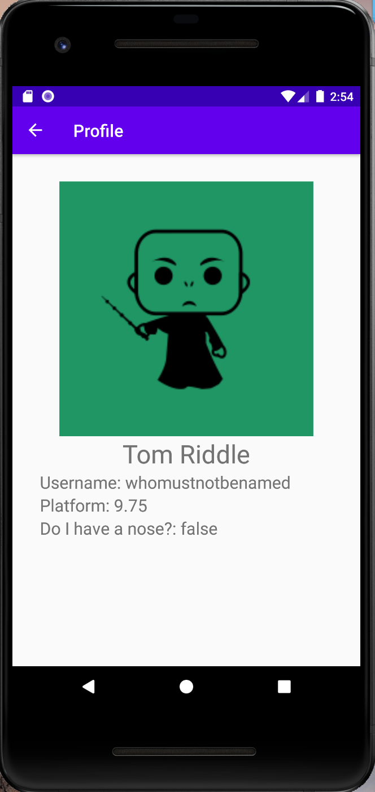

# Dotify by Arjun Aggarwal

This app provides a platform where people listen to music on the cloud!

## Documentation
[Song Data Provider API](https://github.com/echeeUW/SongDataProvider)

## Extra credit
No extra credit attempted

## Screenshots

Profile using JSON and Network Requests 
:-------------------------:|
  | 

## Installation & Usage
The app has a screen that shows a music player. It shows a user’s username, song’s album art,
song title, artist name, number of plays, and some media control buttons.
